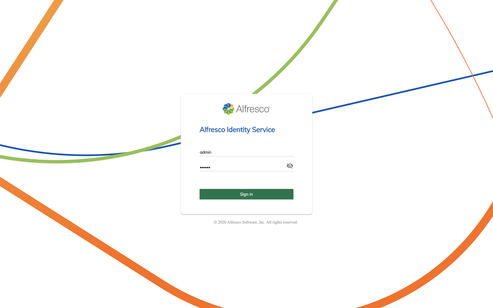

# Alfresco Keycloak Theme

## Overview

The [Alfresco Identity Service](https://github.com/Alfresco/alfresco-identity-service) uses [Keycloak](https://www.keycloak.org/docs/3.4/).  Out of the box, the UI provided by Keycloak is 
quite different from the rest of Alfresco.  But Keycloak allows a customer to provide alternative themes to replace the default
Keycloak themes.  We can use this mechanism to provide an Alfresco theme.

## Design

The following themes can be replaced.
 
* login
* account
* email
* admin 
 
This projects contains a possible theme to replace the login theme.  It was done as an experiment to understand the level of effort and options to implement [DEPLOY-148](https://issues.alfresco.com/jira/browse/AUTH-148).

Several approaches are possible.  
1. **Extend the existing themes**.  With this approach, a copy of the default theme is made and selective
edits are made to the theme.  For example, different style sheets can be
used but otherwise the layout provide by Keycloak could stay the same.
2. **Use ADF**.  With this approach, the ADF component is used directly, effectively making Keycloak 
an ADF app.
3. **Custom login page**.  With this approach, a page is provided that uses the same approved Alfresco
styles.

This project currently uses the approach of a custom login page (option #3).

## Implementation

Since Keycloak supports Freemarker, [a template file](./login/login.ftl) is provided along with 
[css styles](./login/resources/css/styles.css) and [images](./login/resources/img) like those documented to look like the [approved designs](https://app.zeplin.io/project/57d69ef9c8a62bb604985525/screen/5a4dfb3c92a348c3fbe1c586)

## Deployment

1. After installing Keycloak, navigate to the themes directory (e.g. ~/development/keycloak-3.4.3.Final/themes).
2. Create a directory named Alfresco.  
3. Copy the login directory from this project to a login directory in the Alfresco directory you 
just created
4. Start Keycloak and navigate to the admin console theme.  Choose the *Alfresco*
theme as [illustrated](./screen-captures/admin-console-themes.png).  Click *Save*.
5. Login to a oage in the Alfresco realm that requires authentication (e.g. http://localhost:8080/auth/realms/Alfresco/account/) and
you should see a screen like this.

## Next Steps

This is a candidate to include in the Alfresco Identity Service.  

## More Information

If you want to learn more about how to customize Keycloak themes, go [here](https://www.keycloak.org/docs/3.4/server_development/#_themes).
